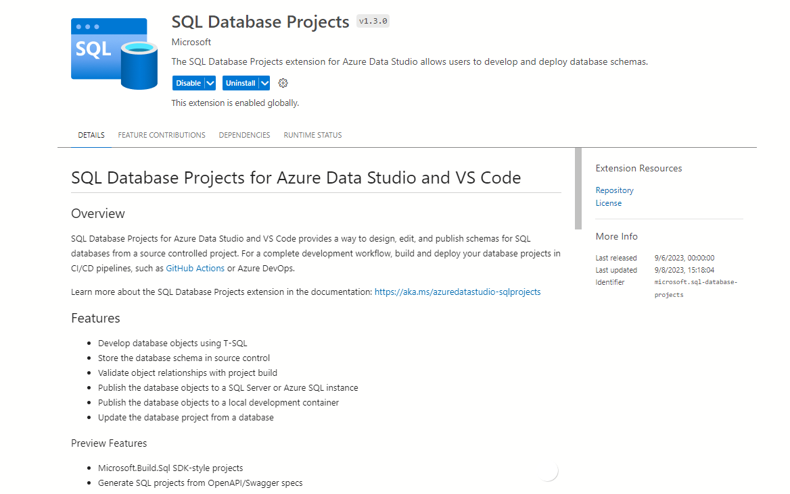

### DDL Extraction Scripts pre-requisites

* Deploy the scripts in this repository (Data Extract Scripts folder) in the source database.
* The managed identity of Azure SQL Data Warehouse Server or Synapse Workspace should be added as a user.
* Following permissions must be given to the Managed Identity before running data extraction scripts
    - GRANT ADMINISTER DATABASE BULK OPERATIONS TO [Managed Service Identity];
    - GRANT ALTER ANY EXTERNAL DATA SOURCE TO [Managed Service Identity];
    - GRANT ALTER ANY EXTERNAL FILE FORMAT TO [Managed Service Identity];
* User running these scripts needs all of these permissions
    - ALTER SCHEMA permission on the local schema that will contain the new table or membership in the db_ddladmin fixed database role.
    - CREATE TABLE permission or membership in the db_ddladmin fixed database role.
    - SELECT permission on any objects referenced in the select_criteria.

### deploy_and_create_migration_scripts_from_source.ps1 -> Deploy as SQL Package

* The PS1 script has a parameter, $CreateSQlProject. If you enable this parameter, then the extracted sql scripts are deployed as a dacpac file to Synapse Data Warehouse in Microsoft Fabric.
* The additional parameters such as $skipViews, $skipSp, $skipfunctions, $skipothers allows you to control which objects can be built, deployed.
* The PS script uses dotnet build and the following dependencies at this time should be installed
    - Install [Azure Data Studio Insider build](https://azuredatastudio-update.azurewebsites.net/latest/win32-x64/insider)
    - Once installed, install SQL Database Projects extension 1.3.0.
    
    - Install [dotnet SDK](https://dotnet.microsoft.com/en-us/download/dotnet/thank-you/sdk-7.0.401-windows-x64-installer) if not installed. You can check the installed SDK's. ```dotnet --list-sdks```
    - Install SQL Package Insider build from [DacFx](https://github.com/microsoft/DacFx) repository.
* Update other PS1 script parameters such as $systemDacpacLocation, $dotnet, $sqlPackageLocation and $connectionString.
* With this, this script helps you to extract sql scripts, create SQL Server Database Project targeting Synapse Data Warehouse in Microsoft Fabric and deploy the data warehouse using SQL Package. **Note**: You can use Azure Data Studio to manage database project.
